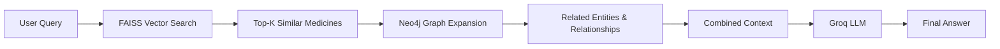

# MEDGraphy: A Hybrid Graph + Vector RAG Drug Information App

MEDGraphy is an intelligent, interactive drug information application that combines **Neo4j graph database** with **FAISS vector search** in a unified Retrieval-Augmented Generation (RAG) pipeline powered by the Groq LLM. This hybrid approach enables both semantic similarity search and complex relationship traversal for comprehensive medical insights.

## 🌐 Live Deployments

- **Hybrid RAG App** (Vector + Graph): [https://huggingface.co/spaces/zenitsu09/medgraphy](https://huggingface.co/spaces/zenitsu09/medgraphy)
- Explore the power of combined vector embeddings and knowledge graph relationships!

## ✨ Features

### Hybrid RAG Architecture
- **Vector Search (FAISS)**: Semantic similarity search across medicine descriptions and uses using sentence embeddings
- **Graph Database (Neo4j)**: Rich relationship traversal for drug interactions, side effects, and therapeutic connections
- **LLM Reasoning (Groq)**: Context-aware answer generation combining both vector and graph knowledge

### Core Capabilities
- **Full RAG Pipeline**: Ask general questions about medicines and get context-aware answers generated by an LLM
- **Direct Medicine Lookup**: Quickly find the uses and side effects of a specific drug
- **Condition-Based Search**: Discover which medicines are used to treat a particular condition
- **Interaction Checker**: Identify potential drug interactions by finding medicines with the same active ingredients
- **Semantic Search**: Find similar medicines based on embeddings of their descriptions or uses
- **Graph Expansion**: Automatically traverse relationships (substitutes, side effects, uses, classes) from retrieved medicines
- **Interactive Graph Visualization**: Explore the relationships between medicines, conditions, side effects, and active ingredients in an interactive graph

## 🛠️ Tech Stack

- **Frontend**: Streamlit
- **Backend**: Python
- **Vector Store**: FAISS (Facebook AI Similarity Search)
- **Graph Database**: Neo4j Aura
- **LLM**: Groq (gpt-oss-120b)
- **Embeddings**: Sentence-Transformers (BAAI/bge-large-en-v1.5)
- **Orchestration**: Hybrid RAG pipeline combining vector retrieval + graph expansion

## 🚀 Getting Started

### 1. Prerequisites

- Python 3.8+
- A running Neo4j Aura instance (or local installation)
- A Groq API Key

### 2. Clone the Repository

```bash
git clone <your-repo-link>
cd MEDGraphy
```

### 3. Set Up a Virtual Environment

```bash
python -m venv venv
source venv/bin/activate  # On Windows, use `venv\Scripts\activate`
```

### 4. Install Dependencies

```bash
pip install -r requirements.txt
```

### 5. Configure Environment Variables

Create a `.env` file in the root directory and add your credentials. For Streamlit Cloud deployment, you will use `st.secrets`.

```env
# Neo4j Credentials
NEO4J_URI="neo4j+s://your-aura-instance.databases.neo4j.io"
NEO4J_USER="neo4j"
NEO4J_PASSWORD="your-password"

# Groq API Key
GROQ_API_KEY="your-groq-api-key"
```

### 6. Load Data into Neo4j

The data for this project is sourced from a CSV file and needs to be loaded into your Neo4j database. This process includes creating nodes, relationships, and vector embeddings.

A Google Colab notebook has been prepared to handle this entire data loading and graph creation process.

**➡️ [Open the Data Loading Notebook in Google Colab](https://colab.research.google.com/drive/1wU_SoKgtj0ucv02O2KWI1IoZor-qLZgA?usp=sharing)**

Follow the instructions in the notebook to connect to your Neo4j instance and populate it with the required data.

### 7. Run the Streamlit App

Once your database is populated and FAISS index is built, you can run the hybrid RAG application:

```bash
streamlit run app.py
```

The application will:
1. Load FAISS vector index for semantic search
2. Connect to Neo4j for graph traversal
3. Initialize Groq LLM for answer generation
4. Combine vector retrieval + graph expansion for comprehensive responses

The application will open in your web browser, ready for you to explore!

## 🔄 How the Hybrid RAG Works



**Query Flow:**
1. **Vector Retrieval**: User query is embedded and searched against FAISS index to find semantically similar medicines
2. **Graph Expansion**: For each retrieved medicine, Neo4j traverses relationships to fetch substitutes, side effects, uses, and classes
3. **Context Fusion**: Vector-retrieved metadata + graph relationships are combined into a rich context
4. **LLM Generation**: Groq processes the hybrid context to generate accurate, grounded answers

## 🧩 New Knowledge Graph Ingestion

You can now ingest the `data/Medicine_Details.csv` directly into Neo4j with embeddings and relationship extraction, plus generate FAISS vector index for hybrid RAG.

```bash
python ingest_graph.py --csv data/Medicine_Details.csv --clear
```

Flags:

- `--limit N` : ingest only first N rows (debug)
- `--clear` : wipe existing graph before loading

This process will:
- Create Neo4j nodes and relationships
- Generate sentence embeddings for each medicine
- Build FAISS index for vector similarity search
- Store metadata for retrieval

## 🔗 Graph Schema (Conceptual)

**Nodes:**

- `Medicine {name, composition, uses_text, side_effects_text, image_url, excellent_review_pct, average_review_pct, poor_review_pct, embedding}`
- `ActiveIngredient {name}`
- `SideEffect {name}`
- `Condition {name}`
- `Manufacturer {name}`

**Relationships:**

- `(Medicine)-[:CONTAINS_INGREDIENT]->(ActiveIngredient)`
- `(Medicine)-[:HAS_SIDE_EFFECT]->(SideEffect)`
- `(Medicine)-[:TREATS]->(Condition)`
- `(Medicine)-[:MANUFACTURED_BY]->(Manufacturer)`
- `(Medicine)-[:INTERACTS_WITH {basis:'shared_ingredient', ingredient}]->(Medicine)` (symmetric, created via shared ingredients)

**Vector Index:**

- `medicine_embeddings` on `Medicine.embedding` (dim 384, cosine)

**FAISS Index:**

- Stores dense embeddings for all medicines
- Enables sub-second semantic similarity search
- Integrated with Neo4j for hybrid retrieval

## 🧪 Advanced Query Capabilities

Added helper methods in `graph_rag_query.py`:

- `get_medicine_with_image(name)` – fetch rich card info including image.
- `symptom_to_medicines(symptoms)` – reverse map symptom keywords to candidate medicines (based on side effects).
- `justify_prescription(medicines)` – returns structured bundle for LLM justification.
- `interaction_conflicts(medicine)` – fetch pre-computed `INTERACTS_WITH` peers.

## 🛤️ Roadmap Ideas

- Add explicit `:CONTRAINDICATED_WITH` from curated rules (composition clashes, duplicate therapeutic class).
- Integrate external pharmacology ontology (RxNorm / ATC) for class-level reasoning.
- Add graph-based similarity (graph embeddings) using Neo4j Graph Data Science.
- Cache RAG contexts per query to reduce latency.
- Implement multi-hop reasoning for complex medical queries.
- Add personalized medicine recommendations based on patient profiles.
